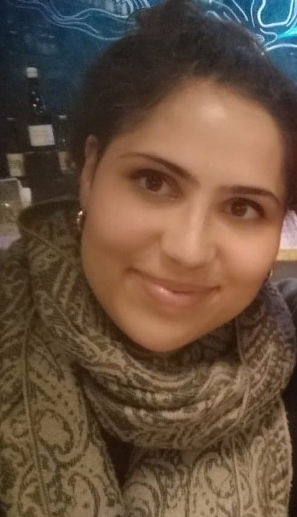

# markdown-challenge

## Alexia Ingber 

*"I must not fear.
Fear is the mind-killer.
Fear is the little-death that brings total obliteration.
I will face my fear.
I will permit it to pass over me and through me.
And when it has gone past I will turn the inner eye to see its path.
Where the fear has gone there will be nothing. Only I will remain."* Dune, Frank Herbert

 
 
 I'm currtently a baby developper stucked in an anthropologist's body
 
 
 
 
|  Birthday   |  Favourite Food   |  Favourite Color   |
| :------------: | :-------------:  | :--------------------:|
| 11/05/90     | Chocolate        | Black               |

 
 #### My Hobbies
 * Cooking 
 * Traveling 
 * Reading Fiction 
     * *"Do Androids Dream of Electric Sheep?"*, Philippe K.Dick
     * *"L'Incal"*, Jodorowsky & Mobius
 * Writing fiction & Poetry
 
    
##### You can always count on me if you feel stressed cause be sure I will always be stressed with you :joy:

---

###### A little funny story to get to know me better :grin:
*"Il ya quelques annees j'avais rendez-vous chez un medecin pour un check-up general. Le rendez-vous etait a 8h30, il etait 8h15, j'ai donc decide de faire un tour du quartier, histoire de me degourdir les jambes. Je vois passer des chiens, des enfants endormis, je regarde les facades des vieilles maisons qui habitent ce quartier et puis la BAM : sur l'une d'elle y etait posee les plaques communes qu'on les medecins et les pratriciens du monde medical mais cette plaque etait differente de toutes les autres plaque, il y etait inscrit " Dentiste Nom Prenom, LSD". Je me retourne alors et marche dans le sens inverse un peu choquee de la nouvelle et avec une furieuse envie d'en savoir d'avantage. Une fois assise dans le cabinet dudit medecin je lui demande : C'est fou pres de chez vous il y a un dentiste qui soigne ses patients avec du LSD? Je ne savais pas que c'etait possible, comment ca marche? C'est utilisee pour les seringues comme anesthesiant?" Le medecin me regarde tres calmement dit " De mon temps, mais je peux me tromper, LSD signifiait "Licencie en Science Dentaire."*
 
[ Previous ] (https://github.com/Ahmad-Hendi/markdown-challeng-#big-fan-of-programing-) ALEXIA [Next] (https://github.com/asadsid56/markdown)
 
